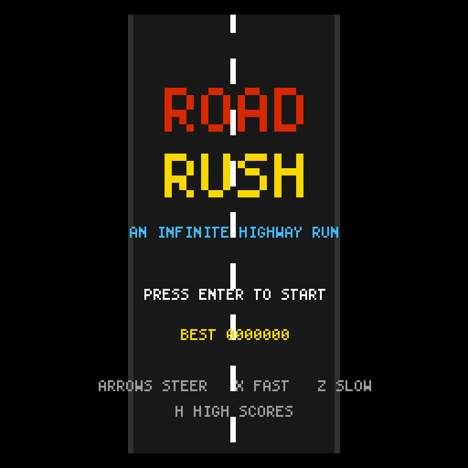
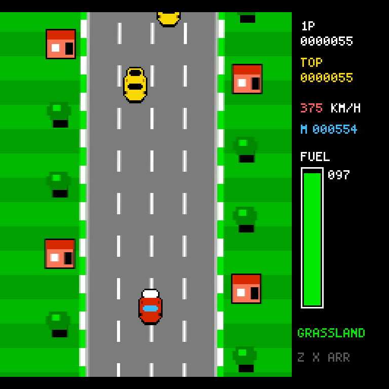
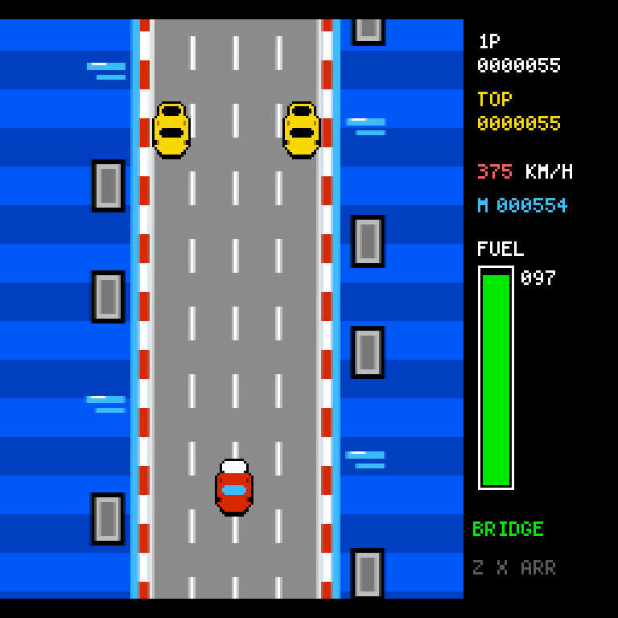
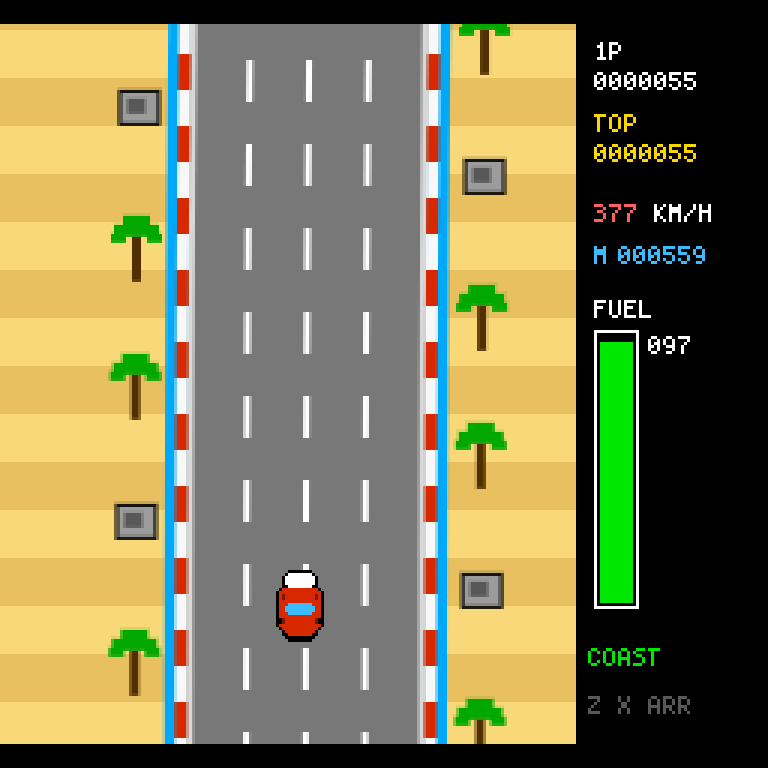
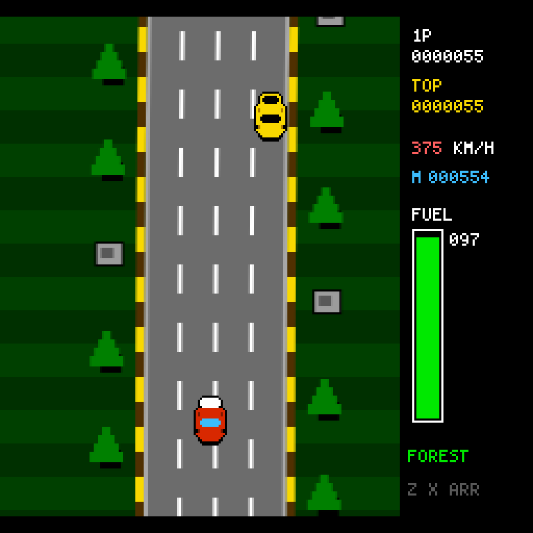
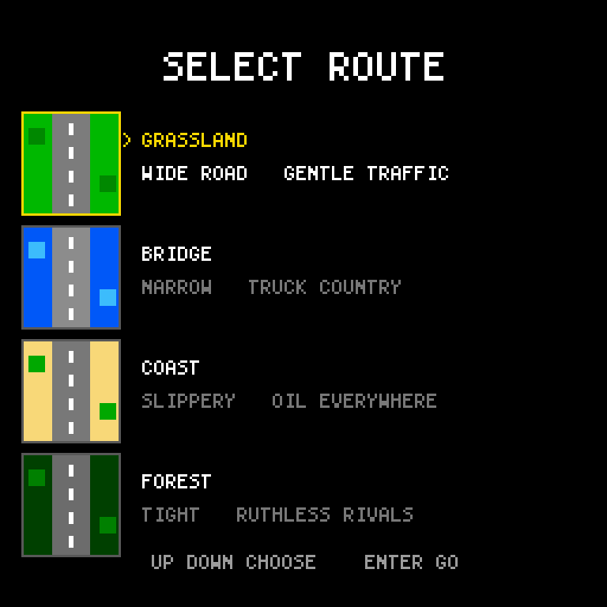
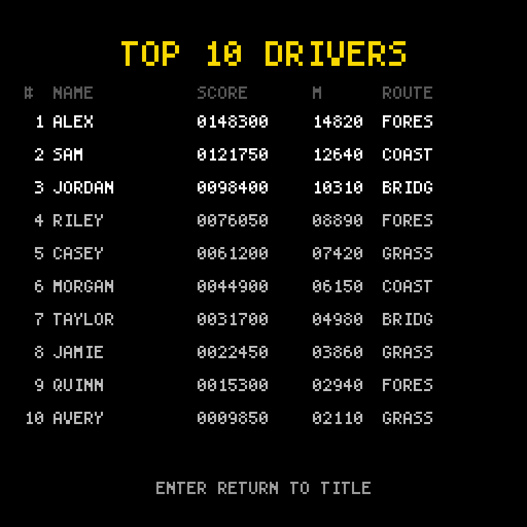
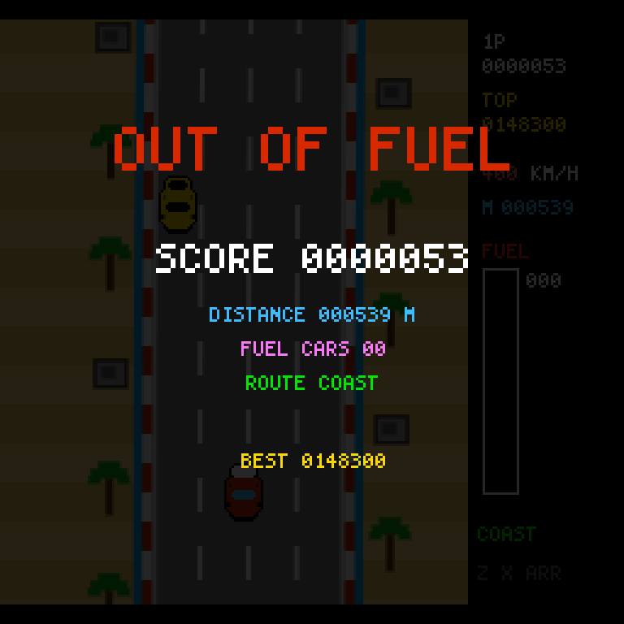

<div align="center">

# Road Rush

**An infinite highway racer in the style of the 1984 arcade classic.**

Pick a route, hold the throttle, and see how far you get before the tank runs dry.
Traffic will not move out of your way — and some of it is actively trying to block you.




</div>

---

## Quick start

```bash
git clone https://github.com/shisukeUrahara/road-rush.git
cd road-rush
npm install
npm run dev
```

Open <http://localhost:5173>. The dev server binds to `0.0.0.0`, so the same URL
works from a phone on your network.

**Requires** Node 20+ and a browser with WebGL.

## Controls

| Input | Action |
| :--- | :--- |
| <kbd>←</kbd> <kbd>→</kbd> | Steer |
| <kbd>X</kbd> · <kbd>↑</kbd> · <kbd>Space</kbd> | Fast throttle — climbs to 400 km/h |
| <kbd>Z</kbd> · <kbd>↓</kbd> | Slow throttle — holds around 224 km/h |
| *release both* | Coast down |
| <kbd>Enter</kbd> | Start · confirm · resume |
| <kbd>Esc</kbd> | Pause, then quit the run |
| <kbd>H</kbd> | High scores (from the title screen) |

On a touchscreen, the left and right halves of the screen steer, the throttle is
automatic, and the bottom-right corner is a low-gear pad.

## Gameplay

<div align="center">

</div>

**Fuel is the clock.** There is no lap counter and no finish line. The tank
drains faster the harder you drive, every crash costs six units, and the run ends
the instant it empties. Distance drives your score, so the whole game is a
negotiation between covering ground and surviving long enough to keep covering it.

**Fuel cars are the economy.** The flashing multicoloured car tops up the tank
and pays a rising chain — 300, 500, 1000, 2000, 3000, 5000, then 10,000 for every
one after that. Miss one, or crash, and the chain drops back to 300. Chasing a
fuel car across three lanes of traffic is usually the most dangerous thing you
will do, which is exactly the point.

**Contact is survivable. Walls are not.** Clip an ordinary car and you go into a
skid. Steer *into* the slide — thrown left, press right — and you recover. Hold
the wrong way and you spin out and explode. Trucks and boulders kill on contact,
oil slicks force an unrecoverable spin, and puddles just scrub your speed.

**Traffic has personalities.** Six of them:

| Vehicle | Behaviour |
| :--- | :--- |
| 🟡 Yellow | Holds its lane. Predictable. |
| 🔴 Red | Changes lane once when it sees you coming, then commits. |
| 🔵 Blue | Waits, then cuts across late. |
| 🔵 Blue *(weaver)* | Drifts between lanes continuously. |
| 🩵 Cyan | Tracks you for about a second before locking in. Nasty. |
| 🚚 Truck | Slow, enormous, and fatal on a narrow road. |

**It gets harder, then it stops getting harder.** Traffic density, enemy reaction
speed and hazard frequency all climb with distance and plateau at 12 km. Fuel
cars grow scarcer over the same stretch, and the road narrows slightly as you go.

**Drive clean and something turns up.** Cover 3000 m without crashing and a
flying figure buzzes the road and drops a 3000 point bonus.

## The four routes

<table>
<tr>
<td width="50%"></td>
<td width="50%"></td>
</tr>
<tr>
<td><b>Grassland</b> — the widest road and the gentlest traffic. Start here.</td>
<td><b>Bridge</b> — narrow, water on both sides, heavy on trucks.</td>
</tr>
<tr>
<td></td>
<td></td>
</tr>
<tr>
<td><b>Coast</b> — sweeping curves and far more oil than anywhere else.</td>
<td><b>Forest</b> — tightest road, densest traffic, most aggressive rivals.</td>
</tr>
</table>

<div align="center">

</div>

## High scores

<div align="center">

&nbsp;

</div>

The top ten runs are kept in `localStorage` under `roadrush.scores.v1`, each with
a name, score, distance and route. They survive a reload and a browser restart.
Everything is local to your browser — there is no server and nothing leaves your
machine.

## Verification

```bash
npm run build       # tsc + vite — the compile gate
npm test            # headless simulation checks, no browser needed
npm run mechanics   # drives a real browser and asserts the game rules
npm run capture     # screenshots every screen, start to finish
npm run routes      # one screenshot per route
```

`npm test` is the one that matters for fairness. It drives every route for 90
simulated seconds across five seeds and asserts that **the player is never shown
a wall of traffic with no gap in it** — the single failure that would make the
game unwinnable through no fault of the driver. It also checks that the road
stays populated, that a given seed replays identically, that difficulty plateaus
instead of running away, and that the score table survives corrupt or missing
storage.

`npm run mechanics` covers what only a live run can prove: the fuel chain paying
300 / 500 / 1000 in order, oil spinning the car, boulders exploding it, puddles
merely slowing it, and the crash-free bonus firing.

The browser tools use a Chromium from Playwright's cache and run under
`xvfb-run`. Software rendering is fine — they assert on pixels and game state,
not on frame rate.

## Project layout

| File | Responsibility |
| :--- | :--- |
| `src/main.ts` | Boot and the fixed 60 Hz timestep loop |
| `src/game.ts` | Screen state machine, scoring, fuel, collisions |
| `src/player.ts` | Throttle, steering, skid and crash state machine |
| `src/traffic.ts` | AI personalities, formation spawner, passability guard |
| `src/road.ts` | Road geometry as a function of distance |
| `src/render.ts` | Paints the 256×240 field and its scenery |
| `src/display.ts` | Babylon layer — pixel canvas onto a fullscreen quad |
| `src/sprites.ts` | ASCII-grid pixel art compiled to canvases |
| `src/font.ts` | 4×6 bitmap font |
| `src/hud.ts` | Gauges and every menu screen |
| `src/scores.ts` | The `localStorage` top ten |
| `src/audio.ts` | WebAudio synthesis |
| `src/terrains.ts` | The four route definitions |

## Implementation notes

**No binary assets.** Every sprite is an ASCII grid painted pixel by pixel onto
a canvas, all text uses a hand-built 4×6 bitmap font, and every sound is
synthesized through WebAudio at runtime. The repository contains no images and
no audio files.

**Pixel-exact rendering.** The game paints a single 256×240 canvas, which
Babylon uploads as a nearest-neighbour texture on a fullscreen orthographic
quad. The result stays sharp and correctly proportioned at any window size.

**The road is a function, not a list.** Its centre and width are computed
directly from distance, so any point on the infinite course can be evaluated on
demand and a seed always replays identically.

**Traffic is authored, not random.** Formations come from a hand-written table,
chosen by a seeded PRNG and planted well ahead of the player. A runtime guard
then watches for rows of cars that have drifted into a sealed wall and packs
them against the nearer edge, opening a gap on the far side. That guard is what
the passability test exercises.

**Generous hitboxes.** Collision boxes are deliberately smaller than the
sprites — roughly two thirds of the player's width — so threading a gap at
400 km/h feels tight but never cheap.

## Credit

Inspired by Konami's *Road Fighter* (1984). No code, art, audio or course
layouts from the original are used here. The flying bonus character is an
original design.

## License

MIT — see [LICENSE](LICENSE).
